

<!-- Global site tag (gtag.js) - Google Analytics -->

{width=50%}
   

The people of Myanmar are facing an unprecedented political, socioeconomic, human rights and humanitarian crisis with needs escalating dramatically since the military takeover and a severe third wave fo COVID-19 in 2021. The expansion of armed conflict into and formation of new armed elements in new areas is driving increased displacement and has exacerbated and generated new protection and food security needs. 

The economic and political turmoil of 2021 is projected to have driven almost half the population into poverty. Increasing numbers of vulnerable people are exhausting their coping capacity and are now slipping into humanitarian need. Price hikes, COVID-19 movement restrictions and ongoing insecurity have forced the most vulnerable to resort to crisis or emergency coping strategies to buy food and other basic supplies. Open conflict, inter-communal tensions and recurrent climate-related shocks continue to undermine the stability and availability of food supplies as well as physical and economic access to food. 

   

# **Announcements**

## Next Coordination Meeting 

**13 September 2022 - 1530 YGN time**

   

# **5W Reports**

 

## **[Q2 2022 5Ws](https://food-security-cluster-myanmar.github.io/fsc_5ws_second_quarter_2022/)**

[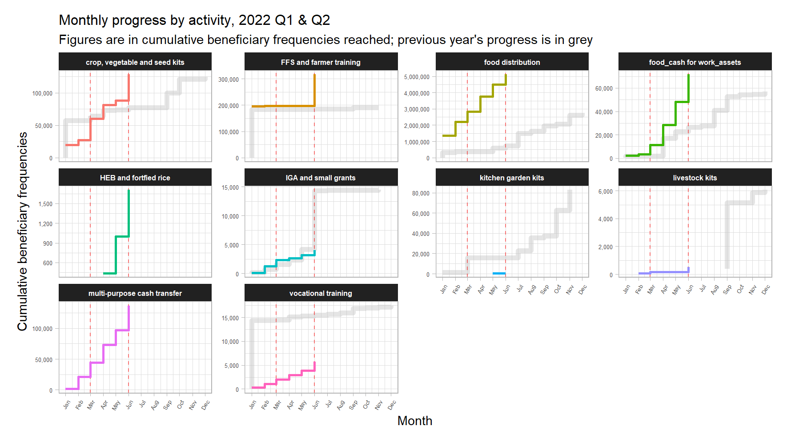](https://food-security-cluster-myanmar.github.io/fsc_5ws_second_quarter_2022/){width=50%}
[PDF version](https://www.dropbox.com/s/gi08lxnhd67s6a1/q2_5ws_report_pdf.pdf?dl=0)

   

## **[Q1 2022 5Ws](https://food-security-cluster-myanmar.github.io/fsc_5ws_first_quarter_2022/)**

[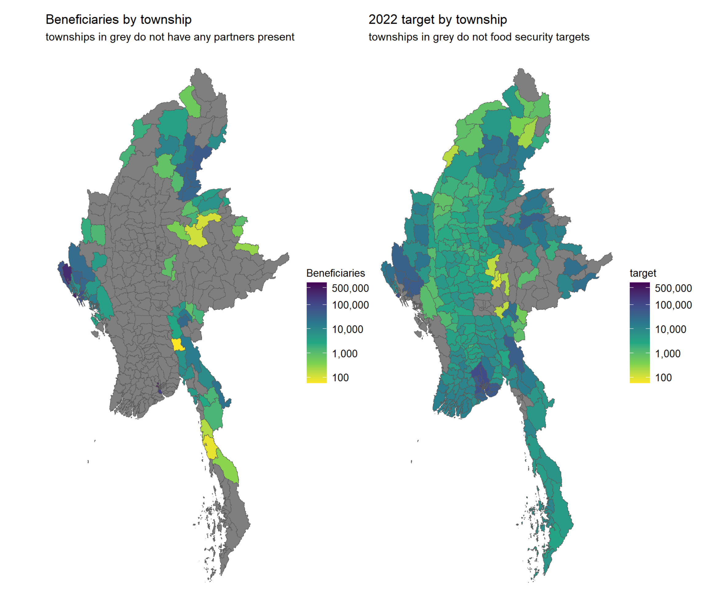](https://food-security-cluster-myanmar.github.io/fsc_5ws_first_quarter_2022/){width=50%}
[PDF version](https://www.dropbox.com/s/ibswwmfhjpp9odh/fsc_2022_q1_5ws_report.pdf?dl=0)

   

## **[Presentation Q1 2022](https://food-security-cluster-myanmar.github.io/q1_2022_5ws_presentation/#1)**

[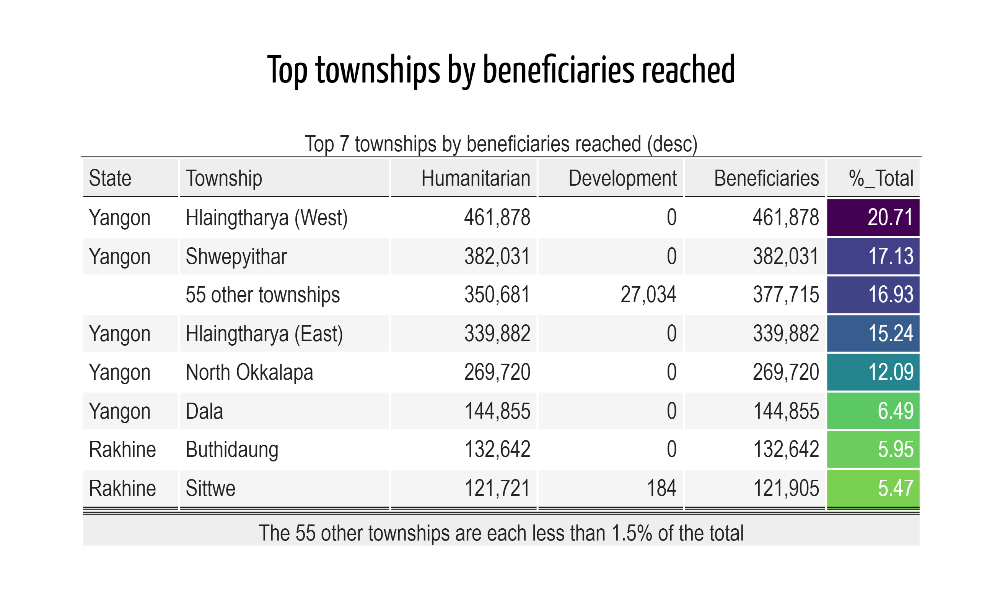](https://food-security-cluster-myanmar.github.io/q1_2022_5ws_presentation/#1){width=50%}
[PDF version](https://www.dropbox.com/s/b7lqb16xv000apm/fsc_results_q1_2022_presentation.pdf?dl=0)

   

## **[2021 End-Year 5Ws](https://food-security-cluster-myanmar.github.io/mmr_5w_initial_observations/)**

[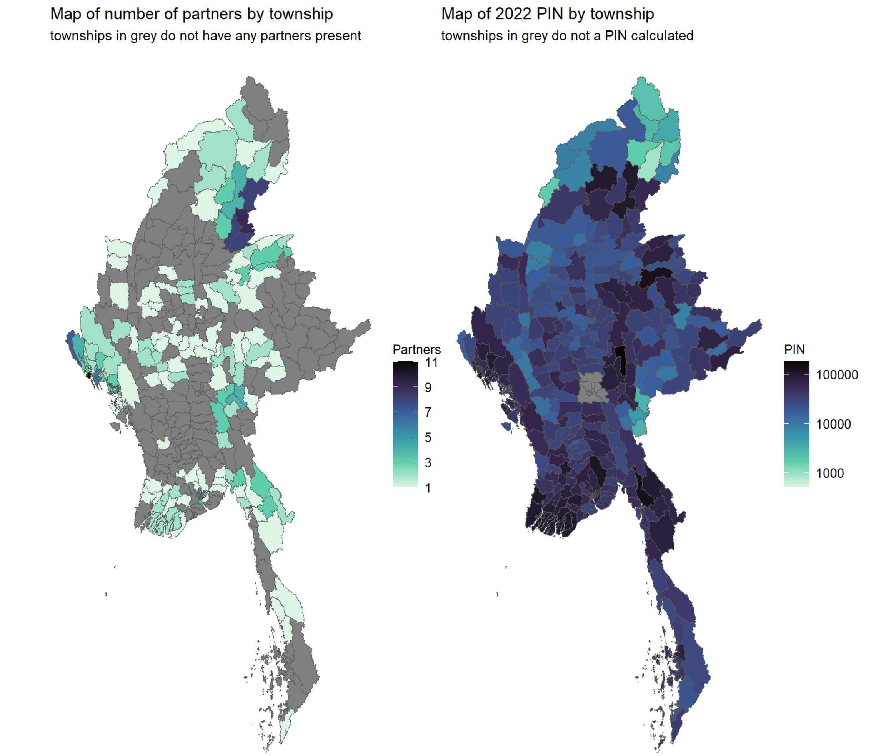](https://food-security-cluster-myanmar.github.io/mmr_5w_initial_observations/){width=50%}
[PDF version](https://www.dropbox.com/s/b1qhi1yskjvdclz/FSC_2021_5Ws_Report.pdf?dl=0)

   

# **Conflict and Prioritisation**

 

## **[Township Prioritisation](https://food-security-cluster-myanmar.github.io/mmr_township_prioritisation/)**
1 June 2022. 

[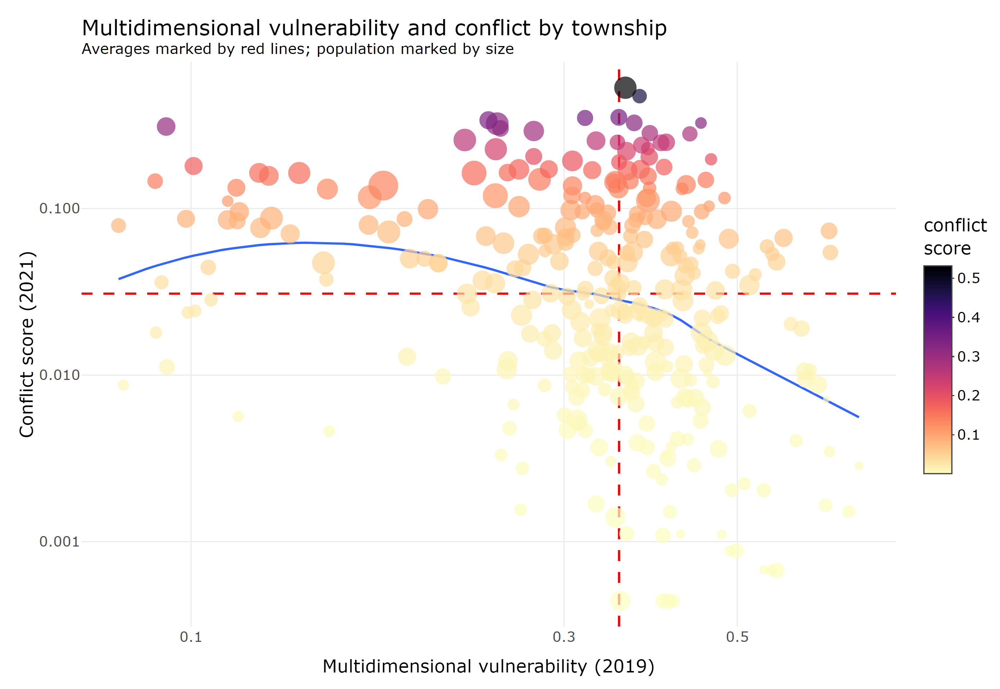](https://food-security-cluster-myanmar.github.io/mmr_township_prioritisation/){width=50%}

   

## **[Understanding Conflict Dynamics in Myanmar through Conflict and Incident Data: A Food Security Perspective](https://food-security-cluster-myanmar.github.io/exploratory-data-analysis-acled-fsc/)**
Updated 1 June 2022. 

[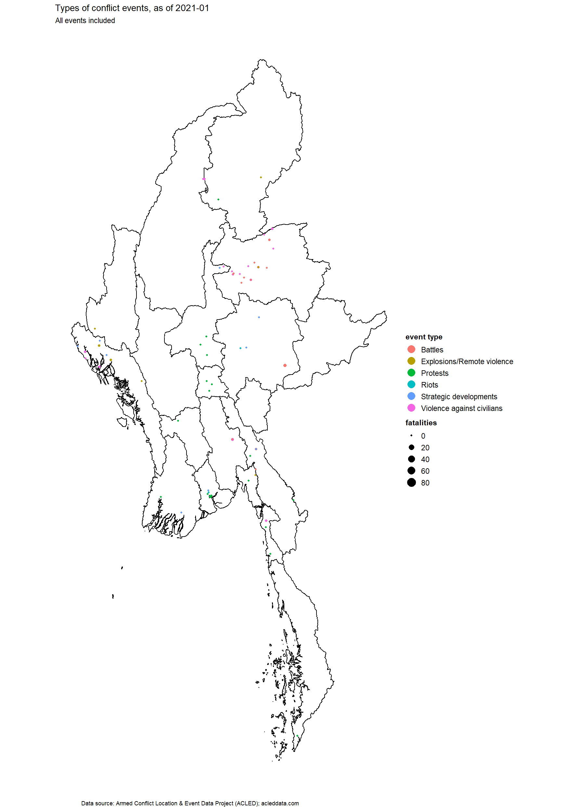](https://food-security-cluster-myanmar.github.io/exploratory-data-analysis-acled-fsc/){width=30%}

   

# **Response Dashboards**

 

## **[Dashboard Q1 2022](https://app.powerbi.com/view?r=eyJrIjoiNGM0NGFlNDAtNWFhOS00ZDM4LTllODEtNDI2MmQ0ZDI5ODM3IiwidCI6IjQ2MmFkOWFlLWQ3ZDktNDIwNi1iODc0LTcxYjFlMDc5Nzc2ZiIsImMiOjh9)**

[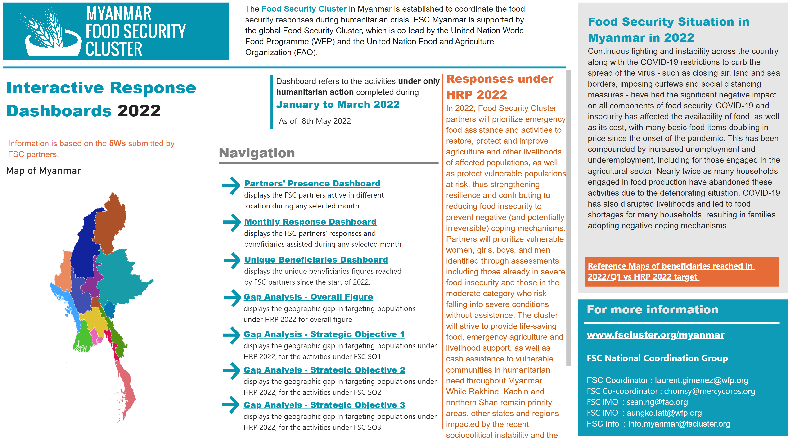](https://app.powerbi.com/view?r=eyJrIjoiNGM0NGFlNDAtNWFhOS00ZDM4LTllODEtNDI2MmQ0ZDI5ODM3IiwidCI6IjQ2MmFkOWFlLWQ3ZDktNDIwNi1iODc0LTcxYjFlMDc5Nzc2ZiIsImMiOjh9){width=50%}

   

## **[Dashboard 2021 Year-End](https://app.powerbi.com/view?r=eyJrIjoiYjIyNDc0OGItNjZhMy00ZjZmLTk0MTgtOTQyOWQ0ZDIyMDg2IiwidCI6IjQ2MmFkOWFlLWQ3ZDktNDIwNi1iODc0LTcxYjFlMDc5Nzc2ZiIsImMiOjh9)**

[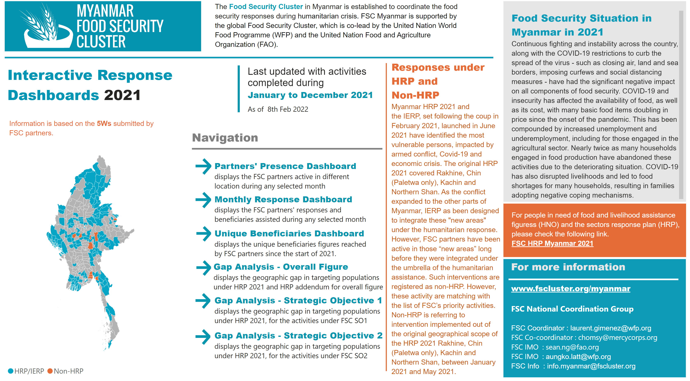](https://app.powerbi.com/view?r=eyJrIjoiYjIyNDc0OGItNjZhMy00ZjZmLTk0MTgtOTQyOWQ0ZDIyMDg2IiwidCI6IjQ2MmFkOWFlLWQ3ZDktNDIwNi1iODc0LTcxYjFlMDc5Nzc2ZiIsImMiOjh9){width=50%}

   

# **Partners' Presence Maps**

 

## **[Q1 2022](https://www.dropbox.com/s/sz8esrolanimdke/FSC%20Myanmar%20Partners%27%20Presence%20and%20Gap%20Analysis%20Maps%20_Jan%20to%20Mar%202022.pdf?dl=0)**
Only PDF available. 4 May 2022. 

[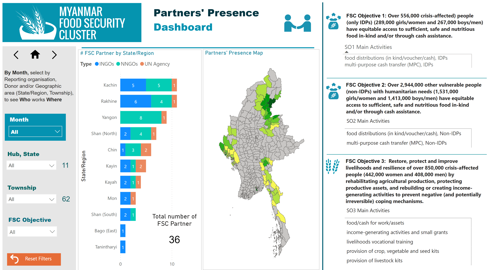](https://www.dropbox.com/s/sz8esrolanimdke/FSC%20Myanmar%20Partners%27%20Presence%20and%20Gap%20Analysis%20Maps%20_Jan%20to%20Mar%202022.pdf?dl=0){width=50%}

   

## **[September 2021](https://fscluster.org/myanmar/document/partners-presence-map-sep-2021)**
Only PDF available

[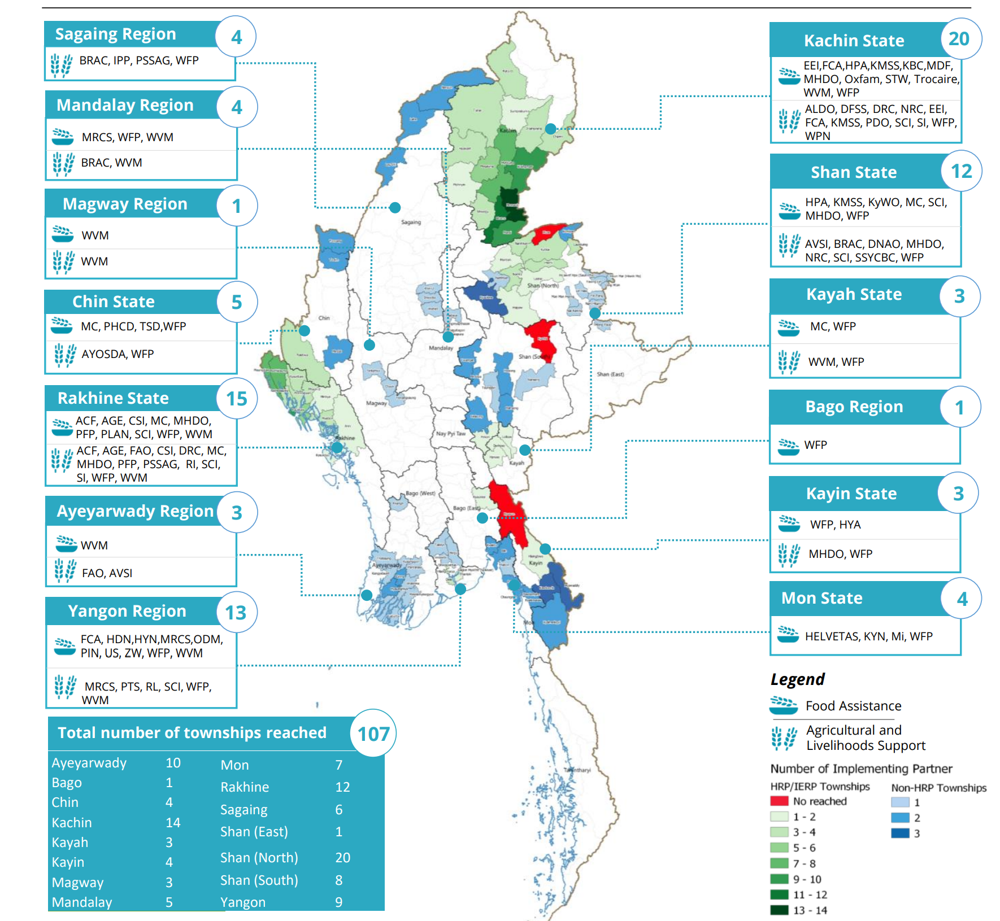](https://fscluster.org/myanmar/document/partners-presence-map-sep-2021){width=50%}

   

# **Miscellaneous**

 

## **[Food Security Workshop Materials](https://food-security-cluster-myanmar.github.io/fsc_workshop_materials/)**
29-30 June 2022. 

[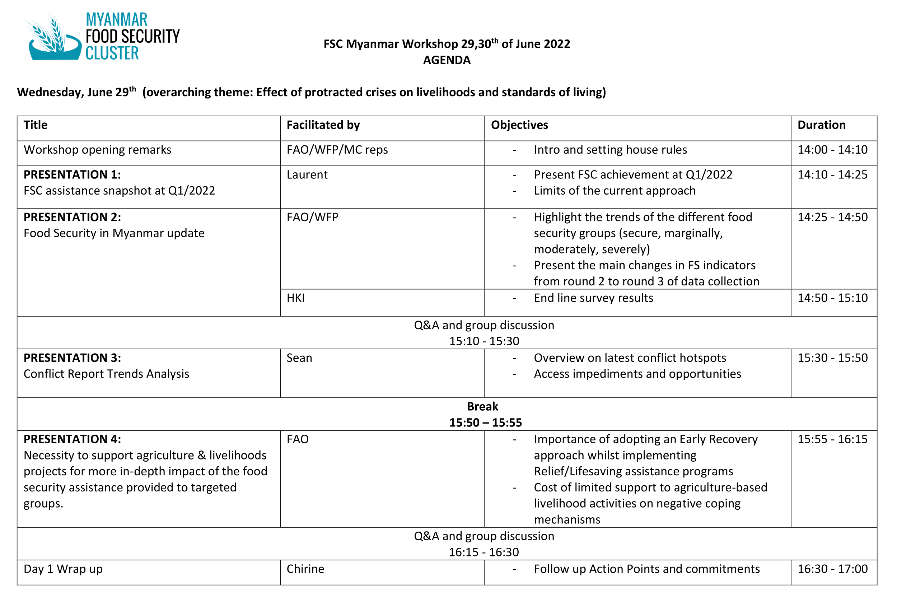](https://food-security-cluster-myanmar.github.io/fsc_workshop_materials/){width=50%}

   

## **[Food Security Analysis -- March 2022](https://www.dropbox.com/s/ky7489xskt5adbc/FSC_Food_Security_Analysis_March_2022.pdf?dl=0)**
Only PDF available

[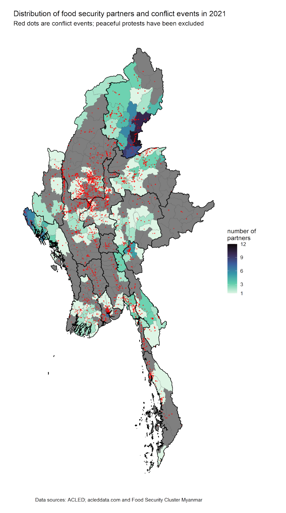](https://www.dropbox.com/s/ky7489xskt5adbc/FSC_Food_Security_Analysis_March_2022.pdf?dl=0)

   

## **[Presentation on Information Sharing Protocol for the ICCG](https://www.dropbox.com/scl/fi/vznb97d5wszyafr5n96mc/presentation_information_sharing_protocol_iccg.pptx?dl=0&rlkey=j8nctw4y8ys2zke3bwesd9t05)**

[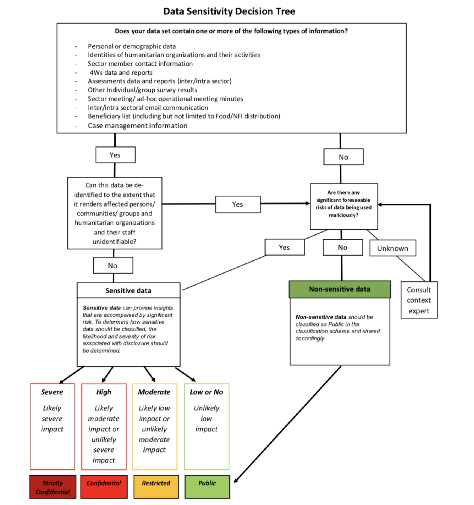](https://www.dropbox.com/scl/fi/vznb97d5wszyafr5n96mc/presentation_information_sharing_protocol_iccg.pptx?dl=0&rlkey=j8nctw4y8ys2zke3bwesd9t05){width=50%}

   

## **[Partners' survey -- 5Ws reporting preferences](https://food-security-cluster-myanmar.github.io/partner_reporting_preferences/)**

[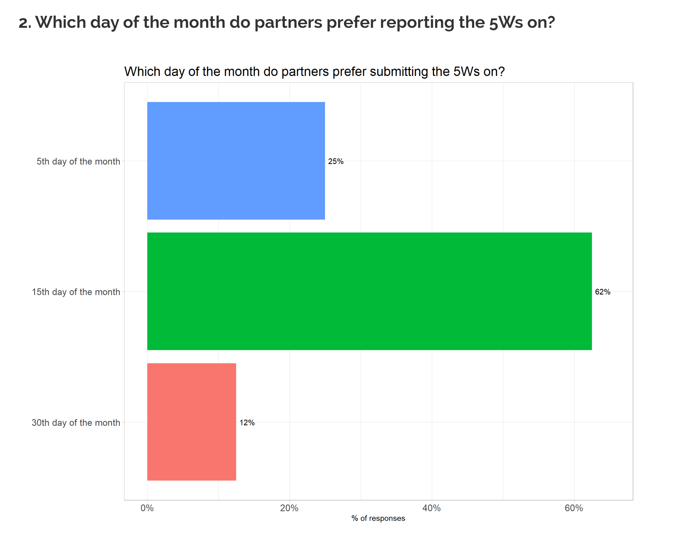](https://food-security-cluster-myanmar.github.io/partner_reporting_preferences/){width=50%}

   

# **Open Data**

# **[Global Food Security Cluster](https://fscluster.org/myanmar)**

[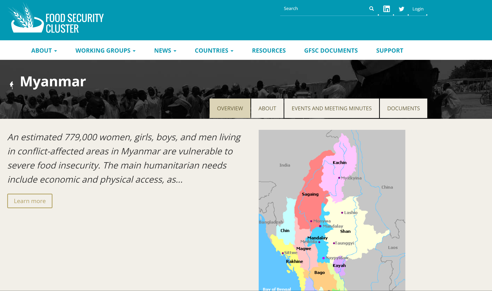](https://fscluster.org/myanmar){width=50%}

   

# **[Myanmar Food Security Cluster](https://github.com/food-security-cluster-myanmar)**

[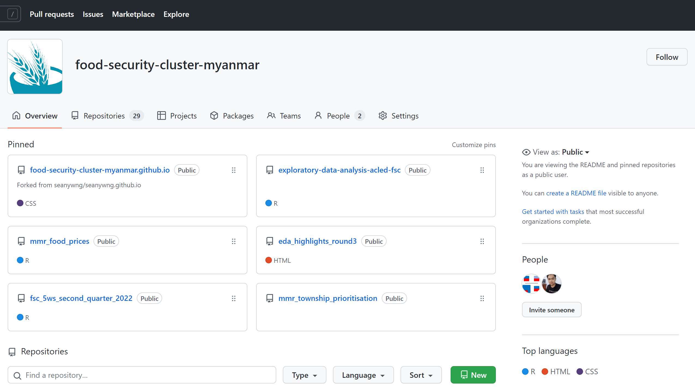](https://github.com/food-security-cluster-myanmar){width=50%}

