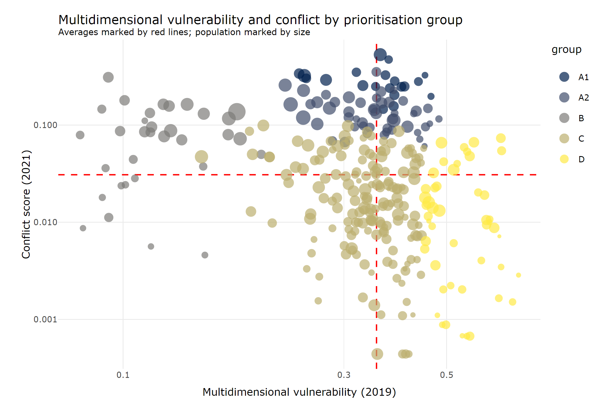

<!-- Global site tag (gtag.js) - Google Analytics -->

{width=50%}
   

Armed clashes between the Myanmar Armed Forces and People's Defense Forces and Ethnic Armed Organisations have continued unabated, with the use of heavy weapons, airstrikes and artillery. There have been 20,395 conflict fatalities since the February 2021 coup and almost 1,000,000 people have been displaced.  

The cost of the basic food basket has increased by 34% compared to last year. 46% of the population is estimated to be living in poverty. To address this unprecedented situation, humanitarian actors in Myanmar have prepared a [Humanitarian Response Plan for 2022](https://reliefweb.int/sites/reliefweb.int/files/resources/mmr_humanitarian_response_plan_2022-final.pdf), requesting USD 826 million in order to reach 6.2 million people in need of life-saving support. 

 

[Contact us](mailto:<FSC Myanmar>info.myanmar@fscluster.org?cc=aungko.latt@wfp.org&subject=Myanmar%20humanitarian%20data)

   

# **Announcements**

## Next Coordination Meeting 

**13 September 2022 - 1530 YGN time**

 

## New releases

**[* Southeast Myanmar Response Snapshot](https://app.powerbi.com/view?r=eyJrIjoiODg2NGE1NWItNGU5Zi00NGZhLTgwMzQtZTEwYjg2NzhlZmQzIiwidCI6IjQ2MmFkOWFlLWQ3ZDktNDIwNi1iODc0LTcxYjFlMDc5Nzc2ZiIsImMiOjh9).**
18 August 2022. Interactive dashboard of food security cluster coverage in townships in Southeast Myanmar. 

 

**[* State Maps comparing Prioritisation and Beneficiaries reached](https://github.com/food-security-cluster-myanmar/mmr_township_prioritisation/tree/main/plots).**
16 August 2022. Link directs to folder with a .png for each state/region. Click on the desired state, then click the download button. Maps are **not** meant to be viewed online. Supplemental plots to the technical document on [Township Prioritisation](https://food-security-cluster-myanmar.github.io/mmr_township_prioritisation/). 

 

**[* Interactive Response Dashboard Q2 2022](https://app.powerbi.com/view?r=eyJrIjoiNDZhN2U5OWQtYjE5MC00MzY2LWI5NmQtZjdlNTU3YzFjNTU2IiwidCI6IjQ2MmFkOWFlLWQ3ZDktNDIwNi1iODc0LTcxYjFlMDc5Nzc2ZiIsImMiOjh9).**
22 July 2022. Interactive response dashboard. 

   

# **5W Reports**

 

### **[Q2 2022 5Ws Report](https://food-security-cluster-myanmar.github.io/fsc_5ws_second_quarter_2022/)**

{width=50%}
[PDF version](https://www.dropbox.com/s/gi08lxnhd67s6a1/q2_5ws_report_pdf.pdf?dl=0)

   

### **[Q1 2022 5Ws Report](https://food-security-cluster-myanmar.github.io/fsc_5ws_first_quarter_2022/)**

{width=50%}
[PDF version](https://www.dropbox.com/s/ibswwmfhjpp9odh/fsc_2022_q1_5ws_report.pdf?dl=0)

   

### **[Presentation Q1 2022](https://food-security-cluster-myanmar.github.io/q1_2022_5ws_presentation/#1)**

{width=50%}
[PDF version](https://www.dropbox.com/s/b7lqb16xv000apm/fsc_results_q1_2022_presentation.pdf?dl=0)

   

### **[2021 End-Year 5Ws Report](https://food-security-cluster-myanmar.github.io/mmr_5w_initial_observations/)**

{width=50%}
[PDF version](https://www.dropbox.com/s/b1qhi1yskjvdclz/FSC_2021_5Ws_Report.pdf?dl=0)

   

# **Conflict and Prioritisation**

 

### **[Township Prioritisation](https://food-security-cluster-myanmar.github.io/mmr_township_prioritisation/)**
1 June 2022. Technical document on the clustering of townships into 5 groups according to multidimensional vulnerability and conflict. 

{width=50%}

 

[Supplemental state/regions maps](https://github.com/food-security-cluster-myanmar/mmr_township_prioritisation/tree/main/plots).
Link directs to folder with a .png for each state/region. Click on the desired state, then click the download button. Maps are **not** meant to be viewed online.

   

### **[Understanding Conflict Dynamics in Myanmar through Conflict and Incident Data: A Food Security Perspective](https://food-security-cluster-myanmar.github.io/exploratory-data-analysis-acled-fsc/)**
Updated 1 June 2022. Exploratory data analysis of the Armed Conflict Location and Event Dataset (ACLED) for Myanmar. Comprehensive overview of conflict in Myanmar since 2021, including conflict trends and patterns, text analytics and comparison with food security cluster footprint. 

{width=30%}

   

# **Response Dashboards**

 

### **[Southeast Myanmar Response Snapshot](https://app.powerbi.com/view?r=eyJrIjoiODg2NGE1NWItNGU5Zi00NGZhLTgwMzQtZTEwYjg2NzhlZmQzIiwidCI6IjQ2MmFkOWFlLWQ3ZDktNDIwNi1iODc0LTcxYjFlMDc5Nzc2ZiIsImMiOjh9)**

{width=50%}

   

### **[Dashboard Q2 2022](https://app.powerbi.com/view?r=eyJrIjoiNDZhN2U5OWQtYjE5MC00MzY2LWI5NmQtZjdlNTU3YzFjNTU2IiwidCI6IjQ2MmFkOWFlLWQ3ZDktNDIwNi1iODc0LTcxYjFlMDc5Nzc2ZiIsImMiOjh9)**

{width=50%}

   

### **[Dashboard Q1 2022](https://app.powerbi.com/view?r=eyJrIjoiNGM0NGFlNDAtNWFhOS00ZDM4LTllODEtNDI2MmQ0ZDI5ODM3IiwidCI6IjQ2MmFkOWFlLWQ3ZDktNDIwNi1iODc0LTcxYjFlMDc5Nzc2ZiIsImMiOjh9)**

{width=50%}

   

### **[Dashboard 2021 Year-End](https://app.powerbi.com/view?r=eyJrIjoiYjIyNDc0OGItNjZhMy00ZjZmLTk0MTgtOTQyOWQ0ZDIyMDg2IiwidCI6IjQ2MmFkOWFlLWQ3ZDktNDIwNi1iODc0LTcxYjFlMDc5Nzc2ZiIsImMiOjh9)**

{width=50%}

   

# **Partners' Presence Maps**

 

### **[Q1 2022](https://www.dropbox.com/s/sz8esrolanimdke/FSC%20Myanmar%20Partners%27%20Presence%20and%20Gap%20Analysis%20Maps%20_Jan%20to%20Mar%202022.pdf?dl=0)**
Only PDF available. 4 May 2022. 

{width=50%}

   

### **[September 2021](https://fscluster.org/myanmar/document/partners-presence-map-sep-2021)**
Only PDF available

{width=50%}

   

# **Miscellaneous**

 

### **[Food Security Workshop Materials](https://food-security-cluster-myanmar.github.io/fsc_workshop_materials/)**
29-30 June 2022. 

{width=50%}

   

### **[Food Security Analysis -- March 2022](https://www.dropbox.com/s/ky7489xskt5adbc/FSC_Food_Security_Analysis_March_2022.pdf?dl=0)**
Only PDF available. Update on food security situation in Myanmar. 

   

### **[Presentation on Information Sharing Protocol for the ICCG](https://www.dropbox.com/scl/fi/vznb97d5wszyafr5n96mc/presentation_information_sharing_protocol_iccg.pptx?dl=0&rlkey=j8nctw4y8ys2zke3bwesd9t05)**

{width=50%}

   

### **[Partners' survey -- 5Ws reporting preferences](https://food-security-cluster-myanmar.github.io/partner_reporting_preferences/)**

{width=50%}

   

# **Open Data**

 

### Information sharing protocol
Current policy on information and data sharing. Approved by the ICCG. [Link](https://www.dropbox.com/s/11kv6cvnbvx9hbe/information_sharing_protocol_220323.pdf?dl=0). 

 

### People in Need and Targets 

Humanitarian response plan PIN and targets for the food security cluster at Admin level 3 (township). [Link](https://github.com/food-security-cluster-myanmar/food-security-cluster-myanmar.github.io/raw/master/data/2022%20HPC%20-%20PiN%20and%20PT.xlsx). 

 

### 2022 5Ws

2022 5Ws as of 2022-06-30. Public dataset at Admin level 3 (township). [Link](https://raw.githubusercontent.com/food-security-cluster-myanmar/food-security-cluster-myanmar.github.io/master/data/fsc_5ws_q2_2022_public.csv). 

 

### 2021 5Ws 

Full 2021 5Ws. Public dataset at Admin level 3 (township). [Link](https://github.com/food-security-cluster-myanmar/food-security-cluster-myanmar.github.io/raw/master/data/fsc_5ws_2021_public.csv). 

 

### ACLED

Extracted 2022-06-06. Conflict reference table, at incident level. Read into .csv for public sharing. [Link](https://raw.githubusercontent.com/food-security-cluster-myanmar/exploratory-data-analysis-acled-fsc/master/data/acled_20220606.csv). 

 

### ACLED Actors 

Extracted 2022-06-06. Conflict reference table -- long table, by incident and actor. Public. [Link](https://github.com/food-security-cluster-myanmar/food-security-cluster-myanmar.github.io/raw/master/data/actors_20220606.csv).

 

### Conflict Scores and Township Clustering

[Link](https://raw.githubusercontent.com/food-security-cluster-myanmar/food-security-cluster-myanmar.github.io/master/data/conflict_score2.csv). Public dataset at Admin level 3. Output of [Township Prioritisation](https://food-security-cluster-myanmar.github.io/mmr_township_prioritisation/). 

 

### Township-level Reference Dataset

General purpose township-level dataset, includes multidimensional vulnerability updated to 2019. Good first dataset for new partners. [Link](https://github.com/food-security-cluster-myanmar/food-security-cluster-myanmar.github.io/raw/master/data/general_township.csv). 

 

### Vulnerability in Myanmar

Census reference dataset. Dataset used for the creation of the MIMU-HARP Vulnerability Index based on 2015 Census data. Public. [Link](https://raw.githubusercontent.com/food-security-cluster-myanmar/exploratory-data-analysis-acled-fsc/master/data/vulmmr.csv). Original report [here](http://themimu.info/vulnerability-in-myanmar).

 

### Shapefiles 

MIMU shapefiles. Administrative level 1 and 3 shapefiles. Public. Links for [Admin level 1](https://geonode.themimu.info/layers/geonode%3Ammr_polbnda2_adm1_mimu_250k) and [Admin level 3](https://geonode.themimu.info/layers/geonode%3Ammr_polbnda_adm3_mimu_250k). 

   

# **[Global Food Security Cluster](https://fscluster.org/myanmar)**

{width=50%}

   

# **[Myanmar Food Security Cluster](https://github.com/food-security-cluster-myanmar)**

{width=50%}

